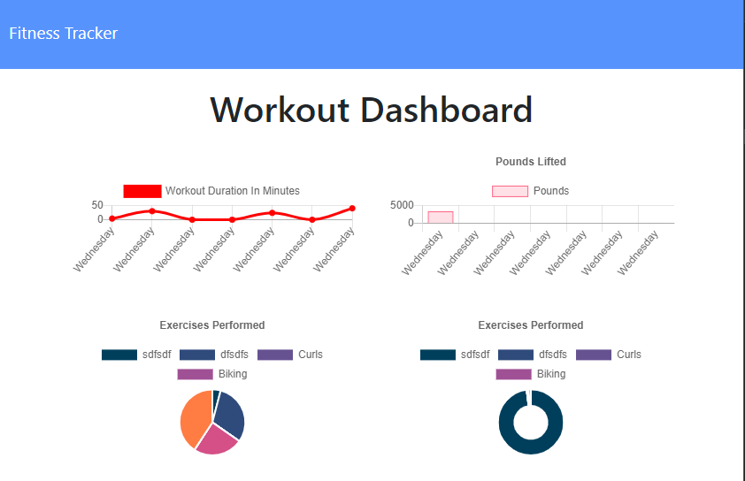

# Fitness Tracker  
This application is a fitness tracker. Keep track of the stats for each workout during each workout session. Start a workout, select resistance or cardio, and enter the stats for that workout. On the dashboard you can view a pie chart and bar chart of your excerise history. This application uses a Mongo DB with a Mongoose schema and Express for handling routes. 

<p align="center">
    
</p>

## Table of Contents:
* [Installation](#installation)
* [Usage](#usage)
* [License](#license)
* [Contributing](#contributing)
* [Tests](#tests)
* [Questions](#questions)
### Installation:
In order to install the necessary dependencies, open the console and run the following:
```npm install```
### Usage:
Click "Add Excersie" to get started, enter your workout stats, then select "Add Exercise" to add another workout to your session or click complete to end. View your history on the dashboard. 

<p align="center">
    
</p>

### License:
This project is licensed under:
MIT
### Contributing:
Contributions are welcome. Please sumbit contributions via email for approval and integration. 
### Tests:
In order to test open the console and run the following:
```npm test```
### Questions:
If you have any questions contact me on [GitHub](https://github.com/sambishop3015) or contact 
Sam Bishop	 at sambishop3015@hotmail.com

        
